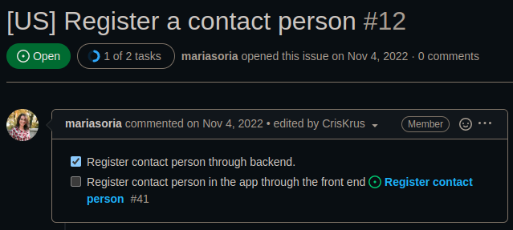
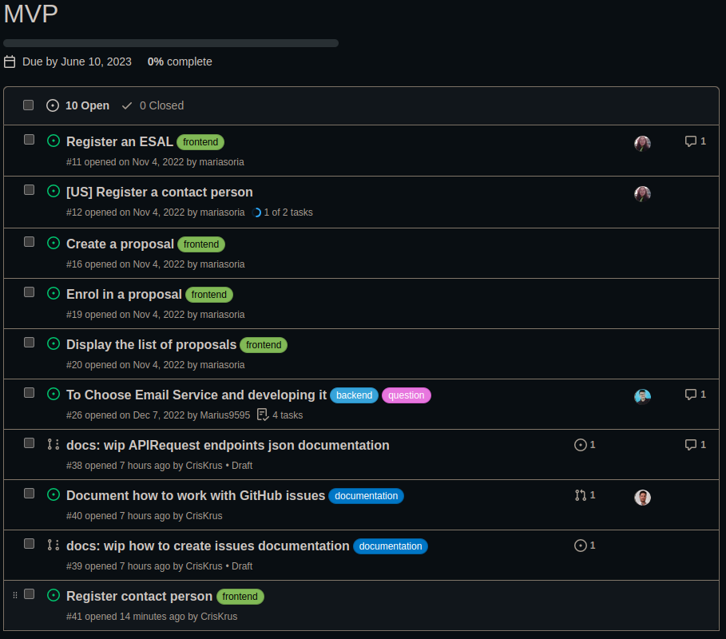

# How to create an issue

In order to easy keep track of the work we will create issues for each task that we are working with.

## Big tasks

If the task that you are working with is so big, and you need to create some other smaller ones, you will need to create 
the smaller one and go to the bigger and paste the link to it as a sub-task.
The bigger tasks could start with __[US]__ meaning that is a __U__ser __H__istory. For example:

- [US] Register a contact person ([issue-12])
  - create endpoint to store the data (issue-N)
  - register contact person through frontend ([issue-41])

After doing this, the issue will be shown like the following:

[issue-12]: https://github.com/lean-mind/huella-positiva/issues/12
[issue-41]: https://github.com/lean-mind/huella-positiva/issues/41

## Milestones

The milestones will be used to attach issues related to a specific version, regardless of how big or small they are. 
For example: MVP milestone.

## Close issues

In order to close an issue:

1. Go to the issue.
2. Go to the button.
3. Click "Close issue"

This action will automatically update the board status to "Done". It does not work in the other way around. If we move 
the issues on the board to "Done" it will not be closed (this will leave a lot of noise in the issue section).
